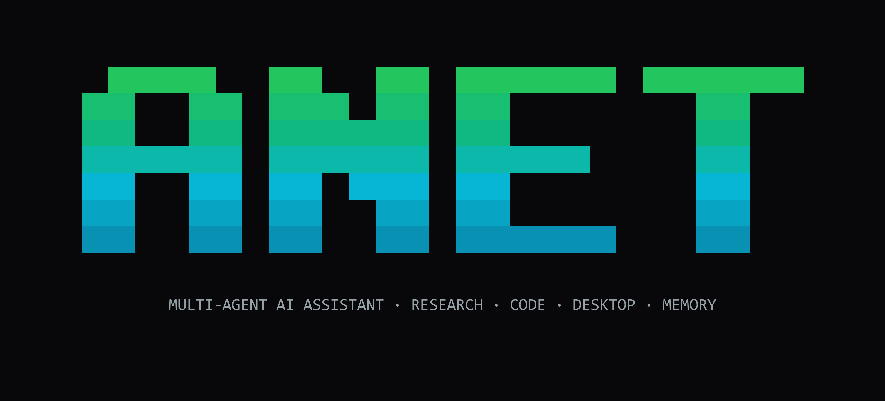
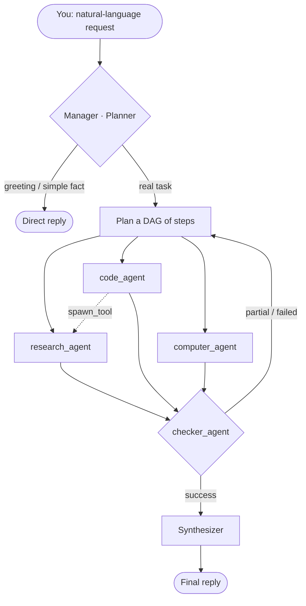
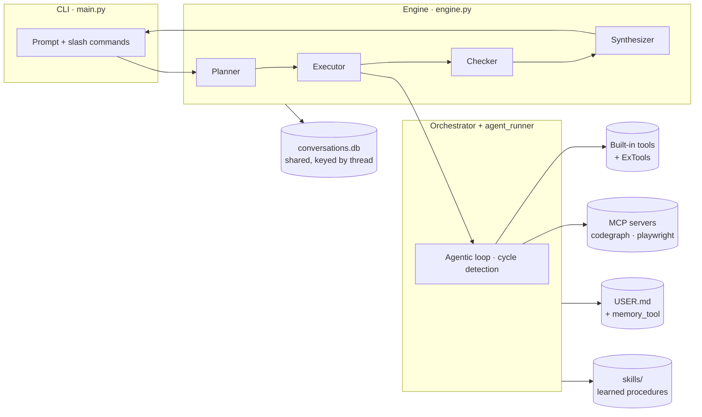
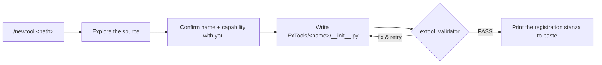
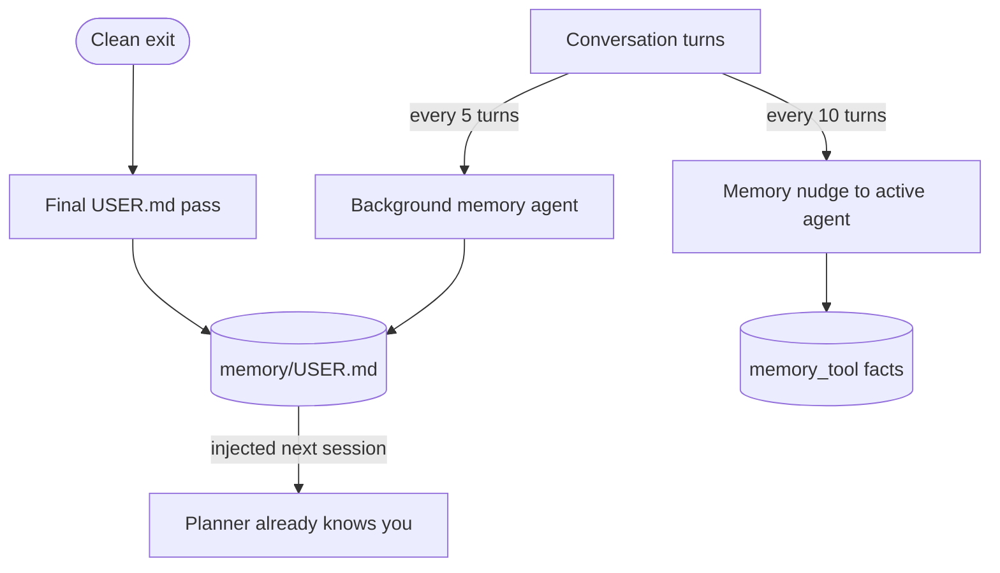

<div align="center">

</div>

<p align="center">
  <strong>Run Claude for code. Gemini for research. GPT for planning.<br>
  All from a single YAML file. No framework lock-in.</strong>
</p>

<p align="center">
  
  
  
  
  
  
  
  
</p>

<p align="center">5 built-in agents · 20+ built-in tools · MCP servers · persistent memory · self-improving skills</p>

<p align="center">
  <a href="#-quick-start">Quick start</a> ·
  <a href="#-how-it-works">How it works</a> ·
  <a href="#-agents">Agents</a> ·
  <a href="#-tools">Tools</a> ·
  <a href="#-extending-anet">Extending</a> ·
  <a href="#-memory--intelligence">Memory</a> ·
  <a href="#-configuration">Configuration</a> ·
  <a href="#-command-reference">Commands</a>
</p>

---

## What is ANet?

ANet is a **local, multi-agent assistant** that routes each request to the right
specialist agent — and each agent can run on the model and provider *you* choose.
One prompt can research the web, write and run code, drive a browser, automate
your desktop, and notify you on Telegram — coordinated automatically, with a
confirmation gate before anything touches your shell or files.

> *“research FastAPI best practices → refactor `routes.py` → run the tests → send me a Telegram when done”* — one prompt.

<p align="center">
  
</p>

---

## Why ANet?

Most agent frameworks lock you into one model, one provider, and one way of working. ANet doesn't.

| | ANet | Typical framework |
|---|---|---|
| **Per-agent model** | ✅ pick model + provider per agent in YAML | ❌ one global model |
| **Web search** | ✅ DuckDuckGo built-in, no key | ❌ paid search API |
| **New tools** | ✅ AI **ToolSmith** scaffolds + validates it | ⚠️ hand-written boilerplate |
| **New MCP server** | ✅ **MCPSmith** drafts + connect-tests config | ⚠️ manual wiring |
| **Safety** | ✅ `y/n/a` confirm before shell/file/edit | ❌ runs blind |
| **Code intelligence** | ✅ real LSP (go-to-def, rename, refs) | ❌ grep-based |
| **Sessions** | ✅ named, resumable, shared store | ❌ fresh every run |
| **Sub-agents** | ✅ `spawn_tool`, depth-limited | ❌ not available |
| **Learns over time** | ✅ self-improving skills + user profile | ❌ no memory of you |

---

## 🚀 Quick start

> **One API key is all you need to start.** Free models are available on OpenRouter, and web search uses DuckDuckGo — no paid search key.

**1. Install**

```bash
git clone https://github.com/Arsh910/Anet.git
cd Anet
pip install -r requirements.txt
```

**2. Add one key** — create a `.env` file:

```env
OPENROUTER_API_KEY=your_key_here
```

**3. Run**

```bash
python main.py
```

That's it. Everything else — Telegram, Vertex AI, MCP servers, extra providers — is optional and added only when you need it.

### What you'll see on launch

```text
   █████  ███   █████      (animated green→cyan banner)

Manager: anthropic/claude-sonnet-4.6 — plans and coordinates all requests

  Agents   6/6 loaded       /agents to view
  Tools    20/20 ready      /tools to view
  MCP      2/2 connected    /mcps to view
```

A compact status line — not a wall of text. Type `/agents`, `/tools`, or `/mcps` to expand any of them. Then just talk to it:

```text
You: find the latest Node.js LTS and write it to version.txt
You: open notepad and type today's AI headlines
You: refactor src/api.py and run the tests
```

### Resume & sessions

```bash
python main.py --resume               # continue your last session
python main.py --session my-project   # open (or create) a named session
python main.py --list-sessions        # list all saved sessions
```

---

## 🧠 How it works

ANet routes your request through a **planning layer** that decides which agents run, in what order, and which can run in parallel. Each agent has its own model, its own tools, and its own job.



Independent steps run **concurrently**; dependent steps wait. After each step the **checker** classifies the result (success / partial / failure) and can trigger a retry with an adjustment before the **synthesizer** writes your final answer.

### Architecture



### Safety mechanisms

| Guard | Behaviour |
|---|---|
| **Confirmation gate** | `shell_tool` (every command), `edit_tool` (every edit), and destructive `file_tool` actions pause for explicit `y` / `n` / `a` approval |
| **Per-agent step cap** | each agent has a `max_steps` limit (defaults: research 10, code 60, file 25, computer 20, checker 8) |
| **Cycle detection** | the same write operation repeated 3× in a sliding window stops the loop |
| **Spawn depth limit** | `spawn_tool` nesting is capped at 2 to prevent runaway delegation |

---

## 🤖 Agents

| Agent | What it does | Key tools |
|---|---|---|
| **research_agent** | Web research, fact-finding, news, image downloads | `web_search`, `web_fetch`, `download_file` |
| **code_agent** | Write, edit, refactor, test, debug code | `edit_tool`, `shell_tool`, `grep_tool`, `lsp_tool`, `diagnose_tool`, `conflict_tool` + codegraph MCP |
| **file_agent** | File-system ops on non-code files — copy, move, zip, read | `file_tool`, `conflict_tool`, `memory_tool` |
| **computer_agent** | Windows desktop automation — launch apps, click, type, screenshot | `open_app`, `compare_screenshot` |
| **checker_agent** | Validates results from other agents | `checker` |
| **tele_agent** *(example external)* | Send messages, files, photos to Telegram | `tele_tool` |

Each agent defaults to **`gemini-2.5-flash` via OpenRouter** unless you override its model/provider in `anet.config.yaml`.

`ask_user` is auto-injected into every agent. Add **`spawn_tool`** to an agent's tool list to let it delegate a sub-task to another agent at runtime without returning to the manager (built-in `code_agent` and `file_agent` already have it).

> **Platform note:** `computer_agent` (desktop automation) requires Windows. Everything else is cross-platform.

---

## 🧰 Tools

<table>
<tr><th>Files &amp; Code</th><th>Research &amp; Web</th></tr>
<tr><td valign="top">

| Tool | Does |
|---|---|
| `edit_tool` | Surgical old→new edits, unified diff |
| `file_tool` | Read/write/copy/move/zip, CSV/JSON |
| `glob_tool` | Find files by glob, by mtime |
| `grep_tool` | Regex search (ripgrep + fallback) |
| `shell_tool` | Run any shell command |
| `process_tool` | Stream output until a pattern hits |
| `diagnose_tool` | ruff/pyright, eslint/tsc problems |
| `conflict_tool` | Resolve git merge conflicts |
| `lsp_tool` | LSP: defs, refs, rename, symbols |
| `code_execution` | Run code snippets |

</td><td valign="top">

| Tool | Does |
|---|---|
| `web_search` | DuckDuckGo — **no API key** |
| `web_fetch` | URL → clean markdown |
| `download_file` | Download a direct URL |

**Desktop (Windows)**

| Tool | Does |
|---|---|
| `open_app` | Launch/type/click/screenshot |
| `compare_screenshot` | Diff two screenshots |

</td></tr>
</table>

**Coordination & memory**

| Tool | Does |
|---|---|
| `todo_tool` | Session task checklist shown live in the spinner |
| `memory_tool` | Persistent cross-session memory — save, search, delete facts |
| `checker` | Classify a task outcome as success / failure / partial |
| `spawn_tool` | Delegate a sub-task to any other agent (depth-limited to 2) |
| `ask_user` | Ask you a question mid-task (auto-injected) |

### MCP servers

MCP servers extend the tool surface without touching the core. They start once on boot and stay alive for the session; their tools are injected into every agent that declares them.

| Server | What it does |
|---|---|
| **codegraph** | Production-grade code graph — symbol search, full-text search, file tree, dependency/impact analysis |
| **playwright** | Drive a real browser — Chromium / CDP, navigate, click, fill, snapshot, evaluate JS |

---

## 🔧 Extending ANet

The core `anet/` package is never edited. Everything you add lives in `ExTools/`, `ExAgents/`, `mcps/`, and the two config files — `exanet.config.yaml` (external tools + agents) and `anet.config.yaml` (per-agent overrides).

### ✦ The Smiths — let an agent build the integration for you

This is the part most frameworks don't have. Point a built-in **smith** at your code or an MCP server's docs and it scaffolds, **validates**, and hands you the exact config to paste.



| Command | What it does |
|---|---|
| `/newtool <path>` | **ToolSmith** — explores `<path>`, confirms the tool name + capability, writes `ExTools/<name>/__init__.py`, runs `python -m anet.core.extool_validator` until it prints **PASS**, then prints the `exanet.config.yaml` stanza. |
| `/addmcp <path>` | **MCPSmith** — reads an MCP server's repo/docs, confirms name + launch command, writes `mcps/<name>/config.yaml`, verifies with `python -m anet.core.mcp_doctor <name>` until **PASS**, then prints the `anet.config.yaml` wiring. |
| `/mcptest <name>` | Connect-test an already-configured MCP server and list the tools it exposes. |

> The smiths **do not edit your config files** — they generate and validate the code, then print the snippet for you to paste. You decide what gets wired in.

### Add a tool by hand — ExTools

1. Create `ExTools/<tool_name>/__init__.py` exporting:
   - `SCHEMA` — an OpenAI function-calling schema `dict`
   - `run(arguments: dict) -> dict` — sync **or** async
2. Register it under the **`tools:`** key in `exanet.config.yaml`:

```yaml
tools:
  - name: my_tool
    path: ExTools/my_tool      # folder with __init__.py, relative to repo root
```

The running CLI re-reads `exanet.config.yaml` **between turns** and rebuilds its tools/agents whenever the file's timestamp changes — so a *registration* edit is picked up on your next turn without a full restart. (It watches the YAML only; if you change a tool's Python code without touching the YAML, re-save the YAML or restart.)

### Add an agent by hand — ExAgents

External agents are declared **inline** under the **`agents:`** key in `exanet.config.yaml` (there is no `agent.py`). The prompt can be inline or in a file:

```yaml
agents:
  - name: my_agent
    model: openai/gpt-oss-20b:free
    provider: openrouter             # google | openrouter | openai | anthropic | vertex_*
    enabled: true                    # false (or omit the block) = dormant
    prompt_file: ExAgents/my_agent/prompt.md   # or: system_prompt: "..."
    task_types:                      # planner routes here by matching these
      - do the thing
    tools: [my_tool]                 # built-in tools and/or registered ExTools
    mcp: [my_server]                 # optional — servers from mcps/
```

Add `spawn_tool` to `tools:` to let the agent delegate to other agents.

### Add an MCP server by hand

```yaml
# mcps/<server_name>/config.yaml
command: node
args: [/path/to/server.js, serve, --mcp]
```

Then add the server to an agent's `mcp:` list in `anet.config.yaml`. Or just run `/addmcp <path>` to generate and connect-test it for you.

---

## 💾 Memory & intelligence



| Feature | How it works |
|---|---|
| **Persona — `SOUL.md`** | The manager's name, tone, and rules. Injected into planner + synthesizer prompts only (sub-agent prompts stay clean). Disable with `persona.enabled: false`. |
| **User profile — `USER.md`** | A background agent updates it every 5 turns; a final pass runs on clean exit. Injected into the planner next session so ANet already knows you. View with `/profile`. |
| **Memory nudge** | Every 10 substantive turns the active agent is prompted to save genuinely new facts to `memory_tool`. |
| **Context compression** | Past ~40 messages, ANet offers **[f] forget** (keep last 20) or **[c] compress** (summarise). Also `/forget`, `/compress`. |
| **Self-improving skills** | After a task with ≥6 tool calls **and** a self-correction, ANet writes a reusable procedure to `skills/`. Relevant skills (≤3) are injected into future tasks. A startup **Curator** merges duplicates and improves frequently-used skills. View with `/skills`. |

---

## ⚙️ Configuration

### `anet.config.yaml`

```yaml
# Persona (manager only)
persona:
  soul_file: SOUL.md
  enabled: true

# Memory + skills
memory:
  user_profile_enabled: true
  incremental_interval: 5    # background memory review every N turns (0 = off)
  nudge_enabled: true
  nudge_interval: 10
skills:
  enabled: true
  creation_threshold: 6      # min tool calls before a skill is written
  curator_min_skills: 5
  max_injected: 3

# Manager — plans + coordinates everything
manager:
  model: anthropic/claude-sonnet-4.6
  provider: openrouter

# Per-agent overrides — model, provider, max_steps, extra_tools, mcp
agents:
  code_agent:
    model: claude-opus-4-7
    provider: anthropic
    max_steps: 80
    mcp: [codegraph]
  research_agent:
    model: google/gemini-2.5-flash
    provider: vertex_google
    max_steps: 10
```

### Providers

| Provider key | API key / auth | Notes |
|---|---|---|
| `google` | `GOOGLE_API_KEY` | Gemini, direct |
| `openrouter` | `OPENROUTER_API_KEY` | 300+ models via one key, free tier available |
| `openai` | `OPENAI_API_KEY` | GPT models |
| `anthropic` | `ANTHROPIC_API_KEY` | Claude models *(legacy alias: `claude`)* |
| `vertex_google` | `VERTEX_PROJECT_ID` + ADC | Gemini on Vertex AI |
| `vertex_anthropic` | `VERTEX_PROJECT_ID` + ADC | Claude on Vertex AI *(legacy alias: `vertex_claude`)* |

For Vertex AI: run `gcloud auth application-default login` once, then set `VERTEX_PROJECT_ID` in `.env`.

### Environment variables

```env
# Minimum to start
OPENROUTER_API_KEY=your_key_here

# Optional extra providers
GOOGLE_API_KEY=...
OPENAI_API_KEY=...
ANTHROPIC_API_KEY=...

# Vertex AI — also run: gcloud auth application-default login
VERTEX_PROJECT_ID=your-gcp-project-id
VERTEX_LOCATION=us-central1
```

> **External agent credentials** live in the agent's own folder, e.g. `ExAgents/tele_agent/.env` (`TELEGRAM_BOT_TOKEN`, `TELEGRAM_CHAT_ID`) — loaded automatically at startup, not in the root `.env`.

---

## ⌨️ Command reference

| Command | What it does |
|---|---|
| `/agents` · `/tools` · `/mcps` | Show loaded agents / tools / MCP servers |
| `/skills` | List saved skills with usage counts |
| `/profile` | Show the user profile (`USER.md`) |
| `/sessions` · `/session <name>` · `/new` | List / switch / start sessions |
| `/forget` · `/compress` | Trim or summarise old context |
| `/newtool <path>` | **ToolSmith** — scaffold + validate an ExTool |
| `/addmcp <path>` | **MCPSmith** — draft + connect-test an MCP server |
| `/mcptest <name>` | Connect-test an MCP server |
| `/clear` | Clear the screen and redraw the startup view |
| `/help` | Show the command list |
| `ESC` | Stop the running task, return to the prompt |
| `exit` / `quit` | End the session (triggers a `USER.md` update) |

---

## 🖥️ Web dashboard

A FastAPI dashboard runs alongside the CLI:

```bash
python server.py   # http://localhost:8000
```

---

## 📁 Project structure

```text
Anet/
├── main.py                  # CLI entry point
├── server.py                # Web dashboard
├── anet.config.yaml         # Models, persona, memory, skills, per-agent overrides
├── exanet.config.yaml       # External tools + agents
├── SOUL.md                  # Manager persona
│
├── anet/
│   ├── AnetAgents/          # Built-in agent definitions
│   ├── AnetTools/           # Built-in tool implementations
│   ├── cli/banner.py        # Animated startup banner + README image export
│   └── core/
│       ├── engine.py        # Planner → executor → checker → synthesizer
│       ├── orchestrator.py  # Agentic loop, cycle detection, skill tracking
│       ├── agent_runner.py  # Model calls, provider dispatch
│       ├── store.py         # One shared conversation DB, keyed by thread
│       ├── memory_agent.py  # Background memory → USER.md + memory_tool
│       ├── skill_manager.py # Self-improving skills — search, create, curate
│       ├── mcp_loader.py    # MCP server lifecycle
│       └── ex_loader.py     # External agent/tool loader
│
├── mcps/                    # MCP servers (codegraph, playwright)
├── skills/                  # Auto-written procedures (grows over time)
├── ExAgents/  ExTools/      # Your custom agents and tools
└── memory/                  # (under your Anet home, e.g. ~/.anet)
    ├── USER.md              # Auto-built user profile
    └── sessions/
        ├── conversations.db # One shared store for ALL sessions, keyed by thread
        └── <session_id>/    # Per-session folder — metadata only (title.txt)
```

> **Sessions** share a single `conversations.db` keyed by `thread`, so `/session <name>` switches instantly and never loses context. Legacy per-session `checkpoint.db` files are folded into the shared store automatically on first run.

---

## ✅ Requirements

- **Python 3.11+**
- **Node.js** — only for MCP servers (codegraph, playwright)
- `pip install -r requirements.txt`
- **Windows only** for `computer_agent`: `pip install pyautogui pywinauto Pillow`
- **Vertex AI** providers: `pip install google-auth` + `gcloud auth application-default login`

---

<p align="center"><sub>MIT licensed · built with a pure-Python engine, no LangChain, no framework lock-in.</sub></p>
