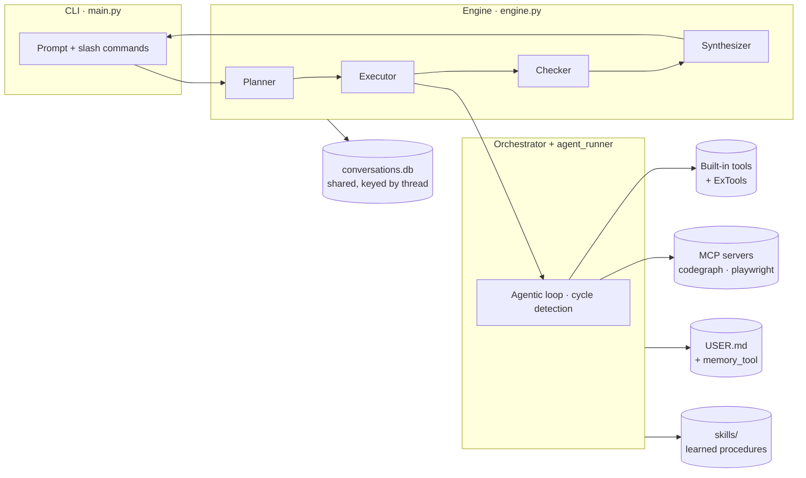
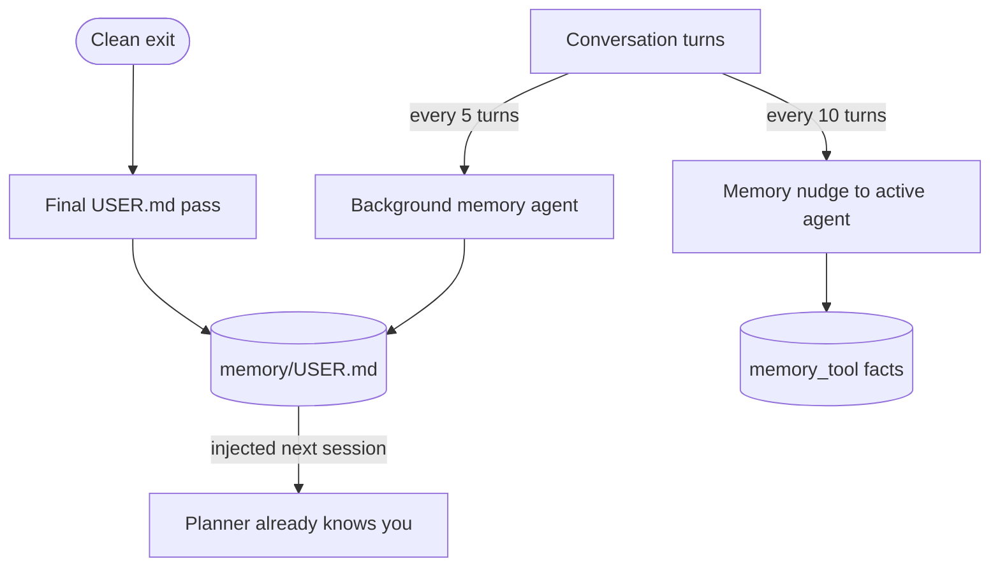
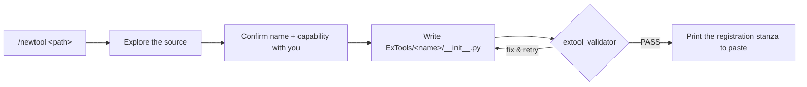

# ANet — Architecture

Internals and design of ANet. For installation and day-to-day usage, see the
[main README](../README.md). For extending ANet, see the per-folder guides:
[ExTools](../ExTools/README.md) · [ExAgents](../ExAgents/README.md) ·
[mcps](../mcps/README.md) · [skills](../skills/README.md).

---

## Request lifecycle

ANet routes every request through a **planning layer** (the "manager") that
decides which agents run, in what order, and which can run in parallel. Each
agent has its own model, its own tools, and its own job.


- **Planner** — classifies the request as `simple` (direct reply) or a `plan`
  (a DAG of steps). Steps declare `depends_on` and `wait_for_async`.
- **Executor** — runs all *ready* steps concurrently (`asyncio.gather`);
  dependent steps wait for their predecessors.
- **Checker** — classifies each step's result as **success / partial / failure**
  and can return an *adjustment* that triggers a bounded retry.
- **Synthesizer** — streams the final answer from the combined step results.

---

## Component architecture



| Module | Responsibility |
|---|---|
| `anet/core/engine.py` | Planner → executor → checker → synthesizer pipeline (pure Python, no LangChain) |
| `anet/core/orchestrator.py` | The agentic loop for one agent: model ↔ tool-call iterations, cycle detection, confirmation gate, skill tracking |
| `anet/core/agent_runner.py` | One model call; provider dispatch (OpenAI-compatible, Anthropic, Vertex) |
| `anet/core/store.py` | `aiosqlite` conversation store — one shared DB keyed by `thread` |
| `anet/core/memory_agent.py` | Background memory — updates `USER.md` and `memory_tool` |
| `anet/core/skill_manager.py` | Self-improving skills — search, create, curate |
| `anet/core/mcp_loader.py` | MCP server lifecycle (launch, list tools, keep alive) |
| `anet/core/ex_loader.py` | Load ExTools/ExAgents from `exanet.config.yaml` |
| `anet/cli/banner.py` | Animated startup banner + README image export |

---

## Safety mechanisms

| Guard | Behaviour |
|---|---|
| **Confirmation gate** | `shell_tool` (every command), `edit_tool` (every edit), and destructive `file_tool` actions pause for explicit `y` / `n` / `a` approval |
| **Per-agent step cap** | each agent has a `max_steps` limit (defaults: research 10, code 60, file 25, computer 20, checker 8) |
| **Cycle detection** | the same write operation repeated 3× in a sliding window stops the loop (reads are exempt) |
| **Spawn depth limit** | `spawn_tool` nesting is capped at 2 to prevent runaway delegation |

---

## Memory & learning loop



- **User profile (`USER.md`)** — a background agent updates it every
  `incremental_interval` turns (default 5); a final pass runs on clean exit. It's
  injected into the planner next session.
- **Memory nudge** — every `nudge_interval` turns (default 10), the active agent
  is prompted to persist genuinely new facts to `memory_tool`.
- **Context compression** — past ~40 messages, ANet offers **[f] forget**
  (keep last 20) or **[c] compress** (summarise). Also `/forget`, `/compress`.
- **Self-improving skills** — see [skills/README.md](../skills/README.md).

---

## Sessions & persistence

All sessions share a single `conversations.db`, keyed by a `thread` column. This
makes `/session <name>` switching instant and lossless — switching is a string
change, not a database reconnect. Each session also keeps a small folder for
metadata (e.g. `title.txt`).

```text
<anet-home>/                 # e.g. ~/.anet  (or ANET_HOME)
├── USER.md                  # auto-built user profile
└── sessions/
    ├── conversations.db     # one shared store for ALL sessions, keyed by thread
    └── <session_id>/        # per-session folder — metadata only (title.txt)
```

> Legacy per-session `checkpoint.db` files (from older versions) are folded into
> the shared store automatically on first run.

---

## The Smiths — assisted integration

ANet ships two standalone agents that scaffold and **validate** integrations for
you, then print the config to paste (they never edit your config files).



- **ToolSmith** (`/newtool <path>`) → validates with `python -m anet.core.extool_validator`.
- **MCPSmith** (`/addmcp <path>`) → verifies with `python -m anet.core.mcp_doctor <name>`.

Details: [ExTools](../ExTools/README.md) and [mcps](../mcps/README.md).

---

## Full project layout

```text
Anet/
├── main.py                  # CLI entry point
├── server.py                # Web dashboard
├── anet.config.yaml         # Models, persona, memory, skills, per-agent overrides
├── exanet.config.yaml       # External tools + agents
├── SOUL.md                  # Manager persona
│
├── anet/
│   ├── AnetAgents/          # Built-in agent definitions
│   ├── AnetTools/           # Built-in tool implementations
│   ├── cli/banner.py        # Animated startup banner + README image export
│   └── core/                # engine, orchestrator, agent_runner, store, memory, skills, loaders
│
├── architecture/            # ← you are here
├── mcps/                    # MCP servers (codegraph, playwright)
├── skills/                  # Auto-written procedures (grows over time)
├── ExAgents/  ExTools/      # Your custom agents and tools
└── memory/ → <anet-home>    # USER.md + sessions/ (see above)
```
