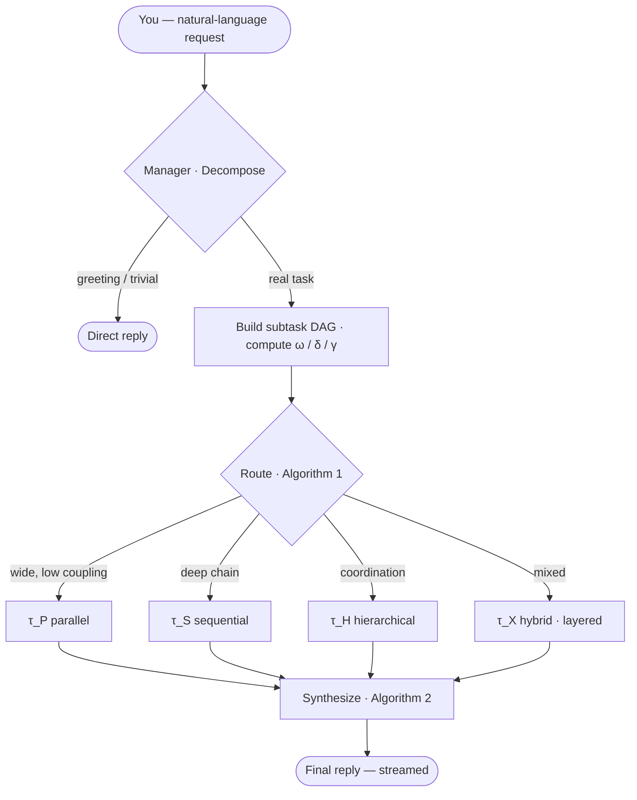
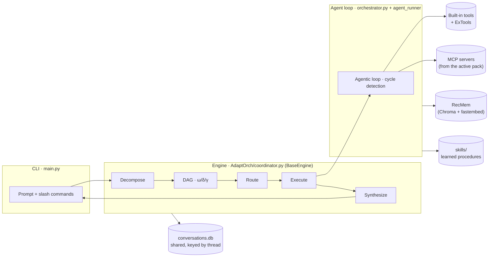
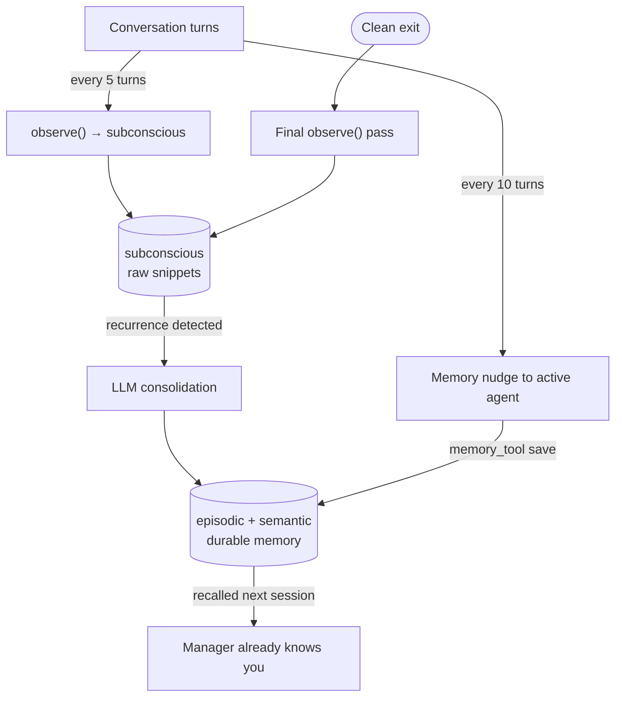
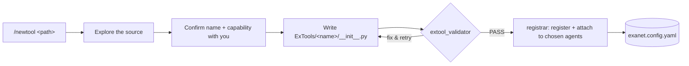
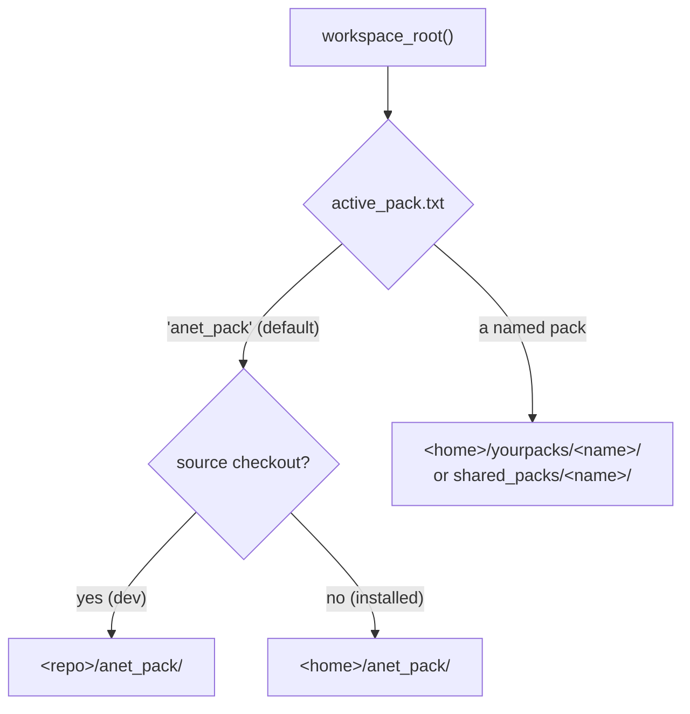

# ANet — Architecture

Internals and design of ANet. For installation and day-to-day usage, see the
[main README](../README.md). For extending ANet, see the per-folder guides:
[ExTools](../anet_pack/ExTools/README.md) · [ExAgents](../anet_pack/ExAgents/README.md) ·
[mcps](../anet_pack/mcps/README.md) · [skills](../anet_pack/skills/README.md).

---

## Request lifecycle

ANet routes every request through **AdaptOrch** — a task-adaptive engine (the
"manager") that decomposes the request into a subtask DAG, measures the graph's
shape, and picks the execution topology that fits it. Each subtask runs an agent
with its own model, its own tools, and its own job. This is the **sole**
orchestration engine (the earlier planner/executor/checker engine was retired).



Five phases (each emits a live status line; per-phase tokens are tracked):

- **Decompose** — an LLM turns the request into subtasks with `depends_on` edges,
  each assigned an agent — or fast-paths a trivial request straight to a reply.
- **DAG** — builds the graph and computes its metrics: **ω** (parallel width),
  **δ** (weighted critical-path depth), **γ** (coupling density), and the layers.
- **Route (Algorithm 1)** — picks a topology from the shape: **τ_P** parallel,
  **τ_S** sequential, **τ_H** hierarchical, or **τ_X** hybrid (layer-by-layer).
- **Execute** — the topology's executor runs each subtask through the shared agent
  loop, threading the right context (predecessor outputs, prior layers) to each.
- **Synthesize (Algorithm 2)** — combines the outputs with the operator that fits
  the join: **compose** (distinct parts), **aggregate** (research findings),
  **vote** (redundant answers → majority), **rank** (candidates), or **resolve**
  (a genuine contradiction → arbiter, with a bounded re-route loop). Streams the
  final answer. Consistency score is a signal *inside* vote/resolve — it no longer
  gates the whole merge, so distinct parallel outputs are composed, not arbitrated.

---

## Component architecture



| Module | Responsibility |
|---|---|
| `anet/core/engine_base.py` | **BaseEngine** — engine-agnostic infra every engine inherits: per-thread state, rolling-summary maintenance (short-term memory), the persistence helper, shared manager-model resolution |
| `anet/core/AdaptOrch/coordinator.py` | **AdaptOrchEngine** — the **sole** orchestration engine (subclasses `BaseEngine`); `run_turn` drives the five phases, emits per-phase status, and streams the answer. A hard pipeline error surfaces as a clean error result — there is no legacy fallback |
| `anet/core/AdaptOrch/{dag,decomposer,router,executors,synthesizer,stage_models}` | **AdaptOrch** phases — decompose → DAG metrics ω/δ/γ → topology router (Algorithm 1) → parallel/sequential/hierarchical/hybrid executors → adaptive synthesis (Algorithm 2, the 5-operator dispatcher). `stage_models` resolves each stage's model. Each `run_subtask` runs an agent via the shared orchestrator loop |
| `anet/core/orchestrator.py` | The agentic loop for one agent: model ↔ tool-call iterations, cycle detection, confirmation gate, skill tracking. Shared — runs every subtask and `spawn_tool` |
| `anet/core/agent_runner.py` | One model call; provider dispatch (OpenAI-compatible, Anthropic, Vertex) |
| `anet/core/tokens.py` | Per-turn token accounting — running total in the spinner, per-stage breakdown in the routing log |
| `anet/AnetTools/toolsets.py` | Capability bundles + the COMMON baseline every agent inherits |
| `anet/core/store.py` | `aiosqlite` conversation store — one shared DB keyed by `thread` |
| `anet/core/context_window.py` | Short-term memory: the token-budgeted rolling-summary + verbatim-recent-turns window (pure logic; driven by `BaseEngine._maintain_summary`) |
| `anet/core/memory_store/` | Long-term memory — a **backend-pluggable** package: re-exports `recmem_store` (default) or `mem0_store`, selected by `memory.backend` |
| `anet/memory/recmem/` + `anet/memory/adapters.py` | Native **RecMem** engine (subconscious → episodic → semantic, recurrence-triggered consolidation) + its fastembed / chromadb / LLM provider adapters |
| `anet/core/skill_manager.py` | Self-improving skills — search, create, curate |
| `anet/core/mcp_loader.py` | MCP server lifecycle (launch, list tools, keep alive) |
| `anet/core/ex_loader.py` | Load ExTools/ExAgents from `exanet.config.yaml` |
| `anet/cli/banner.py` | Animated startup banner + README image export |

---

## Safety mechanisms

| Guard | Behaviour |
|---|---|
| **Confirmation gate** | `shell_tool` (every command), `edit_tool` (every edit), and destructive `file_tool` actions pause for explicit `y` / `n` / `a` approval |
| **Per-agent step cap** | each agent has a `max_steps` limit (defaults: research 10, code 60, computer 20, checker 8) |
| **Cycle detection** | the same write operation repeated 3× in a sliding window stops the loop (reads are exempt) |
| **Spawn depth limit** | `spawn_tool` nesting is capped at 2 to prevent runaway delegation |

---

## Memory & learning loop



- **Short-term memory (rolling window)** — each turn the model is given a
  **token-budgeted** view of the conversation (`context_window.py`, driven by
  `BaseEngine._maintain_summary`): a **rolling summary** of older turns plus as many
  recent turns as fit `context.recent_tokens` (default 3000), with the last
  `min_recent` always kept verbatim. When turns overflow the budget the summary is
  updated automatically (one LLM call, only then) and persisted per-thread, so it
  survives `/session` switches and `--resume`. The AdaptOrch decomposer and its
  executors reason over **summary + verbatim recent turns** (`render_for_prompt`),
  not the summary alone. `/forget` and `/compress` are manual overrides.
- **Long-term memory (RecMem, the default backend)** — a native **3-tier
  recurrence memory** (`anet/memory/recmem/`): raw interactions land in the
  **subconscious** (a cheap embedding buffer, no LLM). Every `incremental_interval`
  turns (default 5) and once on clean exit, recent turns are `observe()`d there.
  When an incoming interaction finds enough semantically-similar snippets already
  buffered (a **recurrence**), and only then, the LLM is invoked once to consolidate
  the cluster into durable **episodic** (event summaries) and **semantic** (facts)
  memory — so most turns cost **zero** memory tokens. Storage is fully local: three
  **Chroma** collections under `~/.anet/memory/recmem/` with **fastembed**
  (on-device) embeddings — no server, no hosted service. `/profile` shows what's
  stored. (Set `memory.backend: mem0` to use the mem0 backend instead, stored under
  `~/.anet/memory/chroma/`.)
- **Memory classification (no hardcoded tags)** — when a memory is saved explicitly
  via `memory_tool`, the LLM classifies it into a **category defined in
  `memory.categories`** (config, not code) and decides which agents it `applies_to`.
  It's stored verbatim in the durable tier with that metadata. Categories marked
  `always_inject: true` (e.g. `preference`, `identity`) reach their agents on every
  task — even when they share no keywords with the request — which is how a standing
  style rule like "prefix functions `anet_`" gets applied. Everything else is
  retrieved by relevance. The classification and scoping are the model's, against
  editable config — no magic tags. (This standing-preference layer is carried in
  per-memory metadata, so it works identically on both backends.)
- **Memory nudge** — every `nudge_interval` turns (default 10), the active agent
  is prompted to persist genuinely new facts via `memory_tool`.
- **Context compression** — past ~40 messages, ANet offers **[f] forget**
  (keep last 20) or **[c] compress** (summarise). Also `/forget`, `/compress`.
- **Self-improving skills** — see [skills/README.md](../anet_pack/skills/README.md).

---

## Sessions & persistence

All sessions share a single `conversations.db`, keyed by a `thread` column. This
makes `/session <name>` switching instant and lossless — switching is a string
change, not a database reconnect. Each session also keeps a small folder for
metadata (e.g. `title.txt`).

```text
<anet-home>/                 # e.g. ~/.anet  (or ANET_HOME)
├── memory/                  # long-term memory — recmem/ (RecMem: 3 Chroma
│                            #   collections) or chroma/ + history.db (mem0)
└── sessions/
    ├── conversations.db     # one shared store for ALL sessions, keyed by thread
    └── <session_id>/        # per-session folder — metadata only (title.txt)
```

> Legacy per-session `checkpoint.db` files (from older versions) are folded into
> the shared store automatically on first run.

---

## The Smiths — assisted integration

ANet ships three standalone agents (never seen by the manager) that scaffold,
**validate**, and **wire up** integrations for you.



| Smith | Command | Validates with | Then |
|---|---|---|---|
| **ToolSmith** | `/newtool <path>` | `extool_validator` | registers the ExTool, attaches it to agents you pick |
| **MCPSmith** | `/addmcp <path>` | `mcp_doctor` | attaches the server to agents you pick |
| **AgentSmith** | `/newagent <desc>` | — | writes the prompt + registers the agent with your chosen tools/MCP |
| **PackSmith** | `/packsmith new` / `share` / `add` | `pack_tool` | scaffolds a blank pack / bundles a pack to a zip (secrets stripped) / installs a received zip |

### The `registrar` tool — the safety boundary

All smith config changes go through one built-in tool, `registrar`
(`anet/AnetTools/registrar/`). It **only ever writes `exanet.config.yaml`** — it
is structurally incapable of touching `anet.config.yaml` or the core `anet/`
package. Attaching a tool/MCP to a **built-in** agent is recorded in an `attach:`
section of `exanet.config.yaml`, which the loader merges at startup — so built-in
agents gain capabilities without any edit to `anet.config.yaml`.

| `registrar` action | Effect |
|---|---|
| `list_agents` / `list_tools` / `list_mcps` | Discovery — what's available to attach (drives the multi-select) |
| `register_tool` | Add a `tools:` entry to `exanet.config.yaml` |
| `register_agent` | Add an `agents:` entry to `exanet.config.yaml` |
| `attach` | Add (never remove) tools/MCP to chosen agents (external → their block; built-in → `attach:`) |

**Who can attach to built-in agents:** extending a core (built-in) agent is limited
to the **ToolSmith and MCPSmith** — the registrar checks the calling agent's name
(injected as `_agent_name`) and refuses a built-in attach from anyone else
(e.g. the AgentSmith). External ExAgents have no such limit.

Details: [ExTools](../anet_pack/ExTools/README.md) · [ExAgents](../anet_pack/ExAgents/README.md) · [mcps](../anet_pack/mcps/README.md).

---

## Packs & the active workspace

A **pack** is a self-contained workspace folder (config + ExTools/ExAgents/mcps/
skills + SOUL.md). Which pack is "live" is resolved by `paths.workspace_root()`:



- Packs you **create** (`/packsmith new`) live in `<home>/yourpacks/<name>/`; packs you
  **receive** (`/packsmith add`) live in `<home>/shared_packs/<name>/`. Resolving a named
  active pack searches `yourpacks/` then `shared_packs/`.
- **`<home>/active_pack.txt`** holds the selected pack name (default `anet_pack`).
- `/changepack` writes that pointer, calls `config_loader.reset_cache()`, and sets a
  reload flag so the main loop rebuilds the engine against the new pack before the
  next turn. Every loader reads `workspace_root()`, so the switch is global.
- **Sharing** (`anet/AnetTools/pack_tool/`): `export` copies a pack → zip with all
  `.env`/secrets and heavy junk stripped + an embedded README; `import_pack`
  extracts into `shared_packs/<name>`; both are pure file ops — **pack code is never
  executed**. The PackSmith agent adds the judgment (README writing, secret
  collection, README-documented setup via the approval-gated `shell_tool`).
- First-run **seeding** always targets the *default* pack (`default_pack_root()`), so
  switching the active pack never affects what gets seeded.

---

## Full project layout

```text
Anet/
├── main.py                  # CLI entry point
├── server.py                # Web dashboard
│
├── anet/                    # the read-only core (engine + built-ins)
│   ├── AnetAgents/          # Built-in agent definitions
│   ├── AnetTools/           # Built-in tool implementations (+ registrar)
│   ├── memory/              # RecMem engine (recmem/) + provider adapters (adapters.py)
│   ├── cli/banner.py        # Animated startup banner + README image export
│   └── core/                # engine_base (BaseEngine) · AdaptOrch/ (coordinator + dag, decomposer, router, executors, synthesizer, stage_models) · orchestrator, agent_runner · context_window · tokens, store · memory_store/ (recmem|mem0 dispatch) · skills, loaders, paths, workspace
│
├── anet_pack/               # the DEFAULT PACK (ships with ANet; the dev workspace)
│   ├── __init__.py          # makes it an importable package (so it ships in the wheel)
│   ├── anet.config.yaml     # default models/persona/memory/skills config
│   ├── exanet.config.yaml   # external tools/agents registry (+ attach: for built-ins)
│   ├── SOUL.md              # default persona
│   ├── ExTools/             # example tools (wordcount, tele_tool) + ExTools guide
│   ├── ExAgents/            # example agents (tele_agent) + ExAgents guide
│   ├── mcps/                # example MCP configs (playwright) + mcps guide
│   └── skills/              # example skill + skills guide
│
├── architecture/            # ← you are here
└── <anet-home>/             # the user's data, e.g. ~/.anet  (NOT in the repo)
    ├── anet_pack/           # the user's editable pack (seeded from the bundled one)
    ├── memory/              # long-term memory — recmem/ (RecMem) or chroma/+history.db (mem0)
    ├── anet_files/          # downloads + agent output
    └── sessions/            # conversations.db + per-session metadata
```

> **Dev vs installed:** running `python main.py` from a checkout uses the repo's
> `anet_pack/` as the live workspace (edit-and-test instantly). An installed
> `anet` uses `<home>/anet_pack/`, seeded once from the bundled default pack.
