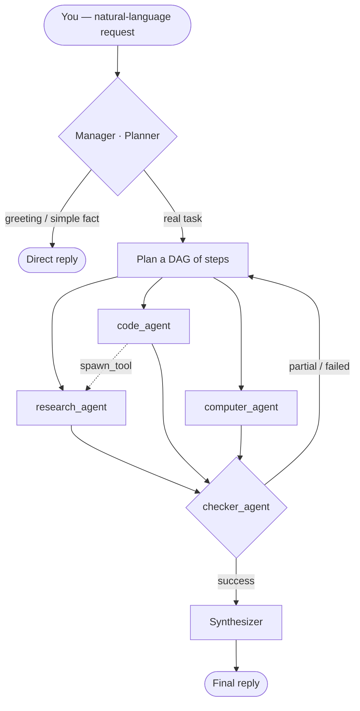
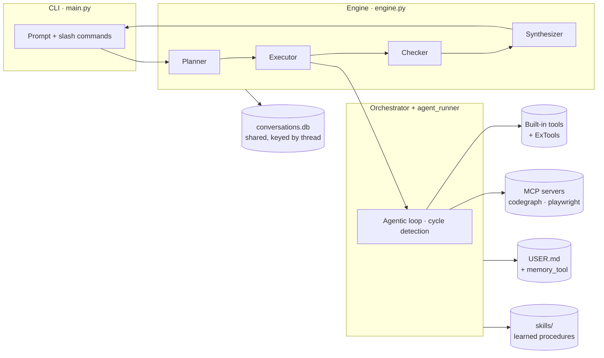
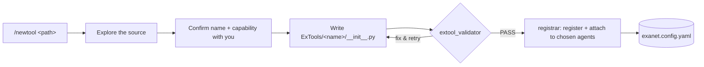
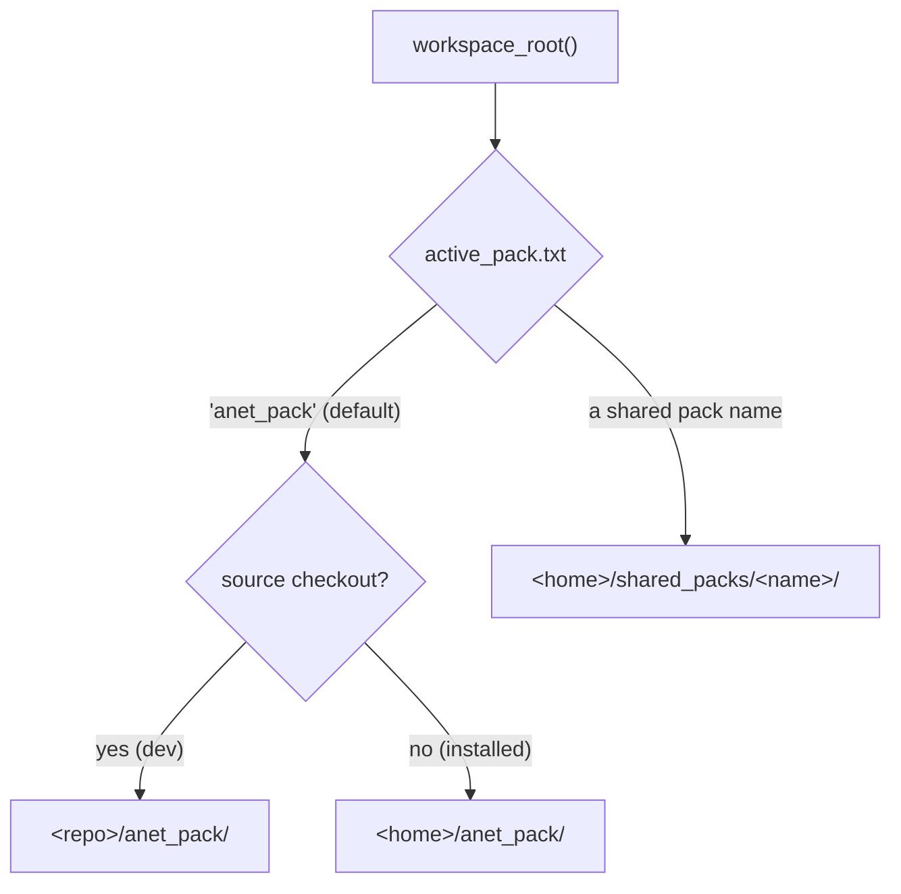

# ANet — Architecture

Internals and design of ANet. For installation and day-to-day usage, see the
[main README](../README.md). For extending ANet, see the per-folder guides:
[ExTools](../anet_pack/ExTools/README.md) · [ExAgents](../anet_pack/ExAgents/README.md) ·
[mcps](../anet_pack/mcps/README.md) · [skills](../anet_pack/skills/README.md).

---

## Request lifecycle

ANet routes every request through a **planning layer** (the "manager") that
decides which agents run, in what order, and which can run in parallel. Each
agent has its own model, its own tools, and its own job.



- **Planner** — classifies the request as `simple` (direct reply) or a `plan`
  (a DAG of steps). Steps declare `depends_on` and `wait_for_async`.
- **Executor** — runs all *ready* steps concurrently (`asyncio.gather`);
  dependent steps wait for their predecessors.
- **Checker** — classifies each step's result as **success / partial / failure**
  and can return an *adjustment* that triggers a bounded retry.
- **Synthesizer** — streams the final answer from the combined step results.

---

## Component architecture



| Module | Responsibility |
|---|---|
| `anet/core/engine.py` | Planner → executor → checker → synthesizer pipeline (pure Python, no LangChain) |
| `anet/core/orchestrator.py` | The agentic loop for one agent: model ↔ tool-call iterations, cycle detection, confirmation gate, skill tracking |
| `anet/core/agent_runner.py` | One model call; provider dispatch (OpenAI-compatible, Anthropic, Vertex) |
| `anet/core/store.py` | `aiosqlite` conversation store — one shared DB keyed by `thread` |
| `anet/core/memory_agent.py` | Background memory — updates `USER.md` and `memory_tool` |
| `anet/core/skill_manager.py` | Self-improving skills — search, create, curate |
| `anet/core/mcp_loader.py` | MCP server lifecycle (launch, list tools, keep alive) |
| `anet/core/ex_loader.py` | Load ExTools/ExAgents from `exanet.config.yaml` |
| `anet/cli/banner.py` | Animated startup banner + README image export |

---

## Safety mechanisms

| Guard | Behaviour |
|---|---|
| **Confirmation gate** | `shell_tool` (every command), `edit_tool` (every edit), and destructive `file_tool` actions pause for explicit `y` / `n` / `a` approval |
| **Per-agent step cap** | each agent has a `max_steps` limit (defaults: research 10, code 60, file 25, computer 20, checker 8) |
| **Cycle detection** | the same write operation repeated 3× in a sliding window stops the loop (reads are exempt) |
| **Spawn depth limit** | `spawn_tool` nesting is capped at 2 to prevent runaway delegation |

---

## Memory & learning loop


- **User profile (`USER.md`)** — a background agent updates it every
  `incremental_interval` turns (default 5); a final pass runs on clean exit. It's
  injected into the planner next session.
- **Memory nudge** — every `nudge_interval` turns (default 10), the active agent
  is prompted to persist genuinely new facts to `memory_tool`.
- **Context compression** — past ~40 messages, ANet offers **[f] forget**
  (keep last 20) or **[c] compress** (summarise). Also `/forget`, `/compress`.
- **Self-improving skills** — see [skills/README.md](../anet_pack/skills/README.md).

---

## Sessions & persistence

All sessions share a single `conversations.db`, keyed by a `thread` column. This
makes `/session <name>` switching instant and lossless — switching is a string
change, not a database reconnect. Each session also keeps a small folder for
metadata (e.g. `title.txt`).

```text
<anet-home>/                 # e.g. ~/.anet  (or ANET_HOME)
├── USER.md                  # auto-built user profile
└── sessions/
    ├── conversations.db     # one shared store for ALL sessions, keyed by thread
    └── <session_id>/        # per-session folder — metadata only (title.txt)
```

> Legacy per-session `checkpoint.db` files (from older versions) are folded into
> the shared store automatically on first run.

---

## The Smiths — assisted integration

ANet ships three standalone agents (never seen by the planner) that scaffold,
**validate**, and **wire up** integrations for you.



| Smith | Command | Validates with | Then |
|---|---|---|---|
| **ToolSmith** | `/newtool <path>` | `extool_validator` | registers the ExTool, attaches it to agents you pick |
| **MCPSmith** | `/addmcp <path>` | `mcp_doctor` | attaches the server to agents you pick |
| **AgentSmith** | `/newagent <desc>` | — | writes the prompt + registers the agent with your chosen tools/MCP |
| **PackSmith** | `/packsmith share` / `add` | `pack_tool` | bundles the pack to a zip (secrets stripped) / installs a received zip |

### The `registrar` tool — the safety boundary

All smith config changes go through one built-in tool, `registrar`
(`anet/AnetTools/registrar/`). It **only ever writes `exanet.config.yaml`** — it
is structurally incapable of touching `anet.config.yaml` or the core `anet/`
package. Attaching a tool/MCP to a **built-in** agent is recorded in an `attach:`
section of `exanet.config.yaml`, which the loader merges at startup — so built-in
agents gain capabilities without any edit to `anet.config.yaml`.

| `registrar` action | Effect |
|---|---|
| `list_agents` / `list_tools` / `list_mcps` | Discovery — what's available to attach (drives the multi-select) |
| `register_tool` | Add a `tools:` entry to `exanet.config.yaml` |
| `register_agent` | Add an `agents:` entry to `exanet.config.yaml` |
| `attach` | Add (never remove) tools/MCP to chosen agents (external → their block; built-in → `attach:`) |

**Who can attach to built-in agents:** extending a core (built-in) agent is limited
to the **ToolSmith and MCPSmith** — the registrar checks the calling agent's name
(injected as `_agent_name`) and refuses a built-in attach from anyone else
(e.g. the AgentSmith). External ExAgents have no such limit.

Details: [ExTools](../anet_pack/ExTools/README.md) · [ExAgents](../anet_pack/ExAgents/README.md) · [mcps](../anet_pack/mcps/README.md).

---

## Packs & the active workspace

A **pack** is a self-contained workspace folder (config + ExTools/ExAgents/mcps/
skills + SOUL.md). Which pack is "live" is resolved by `paths.workspace_root()`:



- **`<home>/active_pack.txt`** holds the selected pack name (default `anet_pack`).
- `/changepack` writes that pointer, calls `config_loader.reset_cache()`, and sets a
  reload flag so the main loop rebuilds the engine against the new pack before the
  next turn. Every loader reads `workspace_root()`, so the switch is global.
- **Sharing** (`anet/AnetTools/pack_tool/`): `export` copies a pack → zip with all
  `.env`/secrets and heavy junk stripped + an embedded README; `import_pack`
  extracts into `shared_packs/<name>`; both are pure file ops — **pack code is never
  executed**. The PackSmith agent adds the judgment (README writing, secret
  collection, README-documented setup via the approval-gated `shell_tool`).
- First-run **seeding** always targets the *default* pack (`default_pack_root()`), so
  switching the active pack never affects what gets seeded.

---

## Full project layout

```text
Anet/
├── main.py                  # CLI entry point
├── server.py                # Web dashboard
│
├── anet/                    # the read-only core (engine + built-ins)
│   ├── AnetAgents/          # Built-in agent definitions
│   ├── AnetTools/           # Built-in tool implementations (+ registrar)
│   ├── cli/banner.py        # Animated startup banner + README image export
│   └── core/                # engine, orchestrator, agent_runner, store, memory, skills, loaders, paths, workspace
│
├── anet_pack/               # the DEFAULT PACK (ships with ANet; the dev workspace)
│   ├── __init__.py          # makes it an importable package (so it ships in the wheel)
│   ├── anet.config.yaml     # default models/persona/memory/skills config
│   ├── exanet.config.yaml   # external tools/agents registry (+ attach: for built-ins)
│   ├── SOUL.md              # default persona
│   ├── ExTools/             # example tools (wordcount, tele_tool) + ExTools guide
│   ├── ExAgents/            # example agents (tele_agent) + ExAgents guide
│   ├── mcps/                # example MCP configs (playwright) + mcps guide
│   └── skills/              # example skill + skills guide
│
├── architecture/            # ← you are here
└── <anet-home>/             # the user's data, e.g. ~/.anet  (NOT in the repo)
    ├── anet_pack/           # the user's editable pack (seeded from the bundled one)
    ├── USER.md              # auto-built user profile
    ├── anet_files/          # downloads + agent output
    └── sessions/            # conversations.db + per-session metadata
```

> **Dev vs installed:** running `python main.py` from a checkout uses the repo's
> `anet_pack/` as the live workspace (edit-and-test instantly). An installed
> `anet` uses `<home>/anet_pack/`, seeded once from the bundled default pack.
