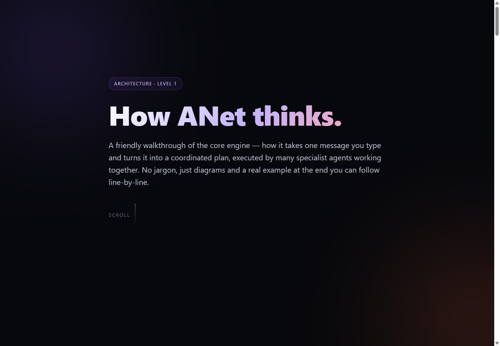

# Level 1 — How ANet thinks

The friendly, no-jargon walkthrough of the core engine: how one message you type
becomes a subtask DAG, gets routed to the right topology, runs across specialist
agents, and comes back as one answer. Diagrams + a real end-to-end example.

### ▶ [Open the interactive page](https://raw.githack.com/Arsh910/Anet/main/architecture/docs/l1/level1.html)

> The image above is a static preview. Click it (or the link) to open the real
> page — styled, animated, and scrollable — in your browser.
> _(GitHub can't render live HTML inside a README; the link renders it.)_

**Covers:** the five phases (Decompose → DAG → Route → Execute → Synthesize) ·
the agentic loop inside one subtask · the safety gate · short-term vs. RecMem
long-term memory · a full worked example.

Next: **[Level 2 — Under the hood →](../l2/README.md)**
