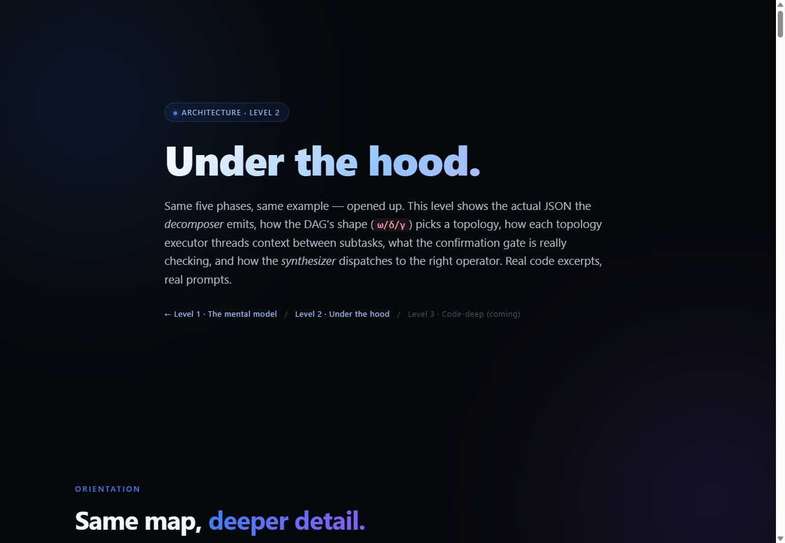

# Level 2 — Under the hood

The deeper pass over the same pipeline: the decomposer's real output schema, how
routing reads the DAG's shape (ω/δ/γ) to pick a topology, how each topology
executes, and how synthesis chooses its operator. Same worked example as Level 1,
traced further down.

### ▶ [Open the interactive page](https://raw.githack.com/Arsh910/Anet/main/architecture/docs/l2/level2.html)

> The image above is a static preview. Click it (or the link) to open the real
> page — styled, animated, and scrollable — in your browser.

**Covers:** Decompose (subtask JSON) · DAG metrics ω/δ/γ/layers · Route /
Algorithm 1 (τ_P/τ_S/τ_H/τ_X + thresholds) · the four topology executors ·
Synthesize / Algorithm 2 (compose/aggregate/vote/rank/resolve) · persistence &
RecMem's 3-tier recurrence memory.

Prev: **[← Level 1](../l1/README.md)** · Next: **[Level 3 — Code-deep →](../l3/README.md)**
