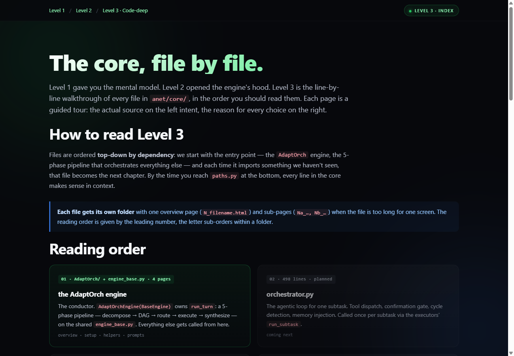

# Level 3 — Code-deep

The line-by-line code walkthrough: the actual engine files behind the phases —
`AdaptOrchEngine` on `BaseEngine`, the decomposer, DAG, router, executors, and the
synthesizer — with real snippets and the prompts each stage uses.

### ▶ [Open the interactive page](https://raw.githack.com/Arsh910/Anet/main/architecture/docs/l3/index.html)

> The image above is a static preview. Click it (or the link) to open the real
> page — styled, animated, and navigable — in your browser.

**Pages:** engine overview · setup/init (`BaseEngine.__init__`, `run_turn`) ·
helpers (`_maintain_summary`, routing, executor context threading, `stage_call`) ·
prompts (the decomposer's system prompt + the synthesizer's operator prompts).

Prev: **[← Level 2](../l2/README.md)**
